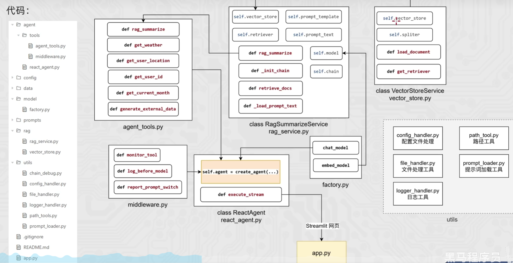

# 智扫通 Agent 项目

智扫通 Agent 项目是一个面向消费者（toC）的智能客服系统，旨在为用户提供全周期的扫地机器人相关服务。

## （1）智能问答服务

- 处理购买前的产品咨询（如功能、价格、对比等）。
- 解决购买后的使用问题（如操作指导、故障处理、维护建议等）。
- 基于 RAG 技术，从知识库中检索准确信息并生成自然语言回答，确保响应及时且可靠。

## （2）使用报告与优化建议生成

- 针对已购买用户，自动分析扫地机器人的使用数据（如清洁频率、耗材状态、错误日志等）。
- 生成个性化报告，总结使用情况并提供优化建议（如清洁计划调整、部件更换提醒等）。
- 支持用户主动查询报告或系统定期推送，帮助用户最大化产品价值

