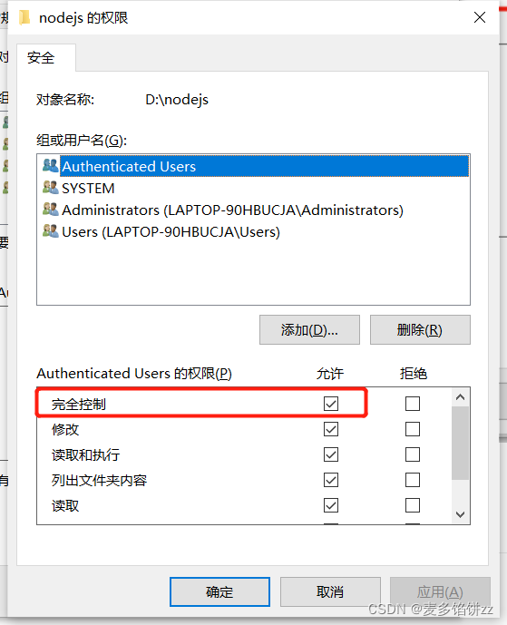

## 问题

```
 npm install
npm ERR! code EPERM
npm ERR! syscall mkdir
npm ERR! path D:\Program Files\nodejs\node_cache\_locks
npm ERR! errno -4048
npm ERR! Error: EPERM: operation not permitted, mkdir 'D:\Program Files\nodejs\node_cache\_locks'
npm ERR!  [Error: EPERM: operation not permitted, mkdir 'D:\Program Files\nodejs\node_cache\_locks'] {
npm ERR!   errno: -4048,
npm ERR!   code: 'EPERM',
npm ERR!   syscall: 'mkdir',
npm ERR!   path: 'D:\\Program Files\\nodejs\\node_cache\\_locks'
npm ERR! }
npm ERR!
npm ERR! The operation was rejected by your operating system.
npm ERR! It's possible that the file was already in use (by a text editor or antivirus),
npm ERR! or that you lack permissions to access it.
npm ERR!
npm ERR! If you believe this might be a permissions issue, please double-check the
npm ERR! permissions of the file and its containing directories, or try running
npm ERR! the command again as root/Administrator.
```

修改nodejs目录，修改权限

