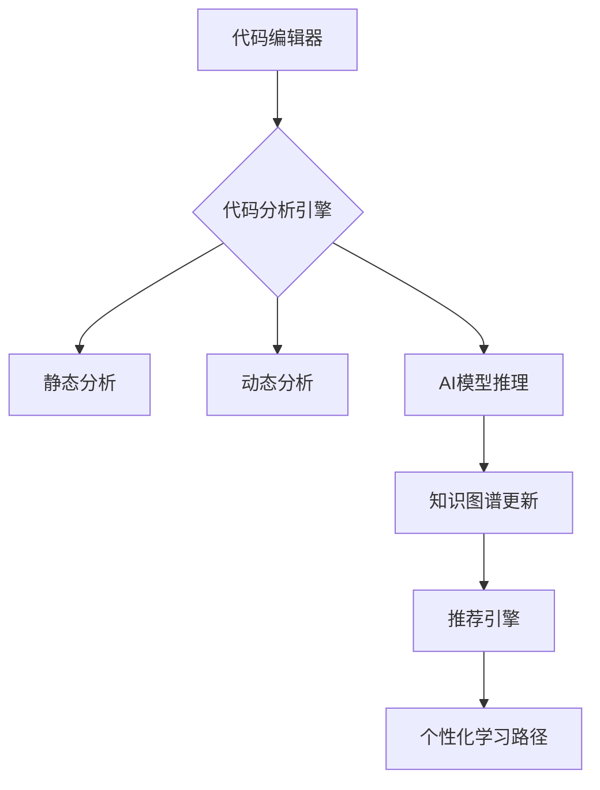

针对软件开发学生的智能学习系统，其核心技术涵盖代码智能分析、知识图谱构建、个性化推荐算法三大核心模块。以下是关键技术实现细节：

---

### 一、代码缺陷分析与优化技术
#### 1. **多维度代码分析引擎**
- **静态分析工具链**
  - **基础检测**：集成SonarQube（Java/Python）、ESLint（JS/TS）、Clang-Tidy（C/C++）等，检测语法错误、代码异味
  - **AI增强检测**：
    - 使用CodeBERT/CodeT5模型识别潜在逻辑缺陷（如循环条件错误、空指针风险）
    - 基于GNN的代码属性图分析（如检测SQL注入路径）
    ```python
    # 示例：基于CodeBERT的缺陷检测
    from transformers import AutoTokenizer, AutoModel
    tokenizer = AutoTokenizer.from_pretrained("microsoft/codebert-base")
    model = AutoModel.from_pretrained("microsoft/codebert-base")
    inputs = tokenizer("for(i=0;i<=10;i--){...}", return_tensors="pt")
    outputs = model(**inputs)  # 输出潜在缺陷标记
    ```
- **动态运行时监测**：
  - 集成JaCoCo（覆盖率分析）、Valgrind（内存泄漏检测）
  - 异常模式追踪（如死锁检测、无限循环捕捉）

#### 2. **智能优化建议生成**
- **AST模式匹配优化**：
  - 使用Tree-sitter生成多语言AST
  - 定义优化规则库（如循环向量化、冗余代码消除）
  ```python
  # AST优化示例：检测可并行化循环
  def visit_ForLoop(node):
      if has_independent_iterations(node):
          suggest_parallel_execution(node)
  ```
- **代码风格自适应**：
  - 动态生成PEP8/Google Style规范建议
  - 基于历史数据推荐个性化命名规则

---

### 二、个人知识图谱构建技术
#### 1. **知识本体建模**
- **核心实体定义**：
  ```yaml
  Concepts:
    - 数据结构: [数组, 链表, 图]
    - 算法: [排序, 动态规划]
    - 关联关系: 
      - 数组 -> 需要掌握 -> 二分查找
      - 链表 -> 常见错误 -> 指针丢失
  ```
- **动态关系发现**：
  - 使用GraphSAGE在图嵌入空间聚类错误模式
  - 概率图模型挖掘知识点关联（如频繁项集挖掘）

#### 2. **图谱实时更新机制**
- **增量式学习框架**：
  - 基于时间衰减因子的权重更新算法：
    ```math
    W_{new} = α·W_{old} + (1-α)·\frac{正确次数}{总尝试次数}
    ```
  - 实时事件处理架构（Kafka流处理+Neo4j事件触发器）

---

### 三、个性化推荐核心技术
#### 1. **多维特征提取**
- **学生能力画像**：
  - 编程能力维度：代码复杂度、调试效率、重构能力
  - 知识掌握度：通过IRT（项目反应理论）模型量化知识点掌握概率

#### 2. **混合推荐算法**
- **深度知识追踪（DKT）**：
  - 使用LSTM/Transformer建模学习轨迹
  ```python
  # PyTorch示例：知识追踪模型
  class DKT(nn.Module):
      def __init__(self):
          super().__init__()
          self.embed = nn.Embedding(num_concepts, 128)
          self.lstm = nn.LSTM(128, 256)
          self.fc = nn.Linear(256, num_concepts)
  ```
- **图增强推荐**：
  - 基于知识图谱的Meta-Path推荐（如"薄弱算法→关联数据结构→推荐练习"）
  - 社区驱动推荐：挖掘GitHub相似项目的高赞解决方案

#### 3. **自适应学习路径生成**
- **强化学习调度器**：
  - 定义状态空间（学生当前水平）、动作空间（推荐内容）、奖励函数（掌握速度/错误率下降）
  - 使用PPO算法动态调整推荐策略
  ```python
  # 伪代码：RL训练循环
  for episode in episodes:
      state = get_student_state()
      action = policy_network(state)  # 推荐学习单元
      reward = calculate_learning_gain()
      update_policy(reward)
  ```

---

### 四、关键技术集成方案
#### 1. **系统架构设计**


#### 2. **性能优化技术**
- **代码分析加速**：
  - 使用Rust重写性能敏感模块（如AST解析）
  - 建立预分析缓存池（LRU缓存常见代码模式）
- **推荐实时性保障**：
  - 图计算优化：Neo4j并行遍历算法
  - 模型轻量化：知识蒸馏压缩推荐模型

---

### 五、技术验证指标
| 技术模块     | 验证指标                   | 目标值 |
| ------------ | -------------------------- | ------ |
| 代码缺陷检测 | F1-score（逻辑错误识别）   | >0.82  |
| 知识图谱构建 | 关系预测准确率             | >90%   |
| 推荐系统     | 推荐接受率+掌握速度提升    | >70%   |
| 系统性能     | 代码分析延迟（1000行代码） | <500ms |

---

该技术体系通过将程序分析、图计算、深度学习深度融合，实现了从代码实践到知识掌握的闭环反馈。实际开发中需重点关注：1）多语言分析的统一抽象层设计 2）知识图谱的动态演化机制 3）推荐系统的冷启动解决方案。建议采用渐进式实施策略，优先构建Python/Java核心支持，再逐步扩展技术栈。


### **系统设计：面向软件开发学生的智能代码分析与优化系统**

#### **1. 系统概述**

该系统针对软件开发领域的学生，构建一个智能化学习与代码优化平台。系统通过自动分析学生提交的代码，检测漏洞和优化点，同时构造个人知识图谱，精准识别学生的薄弱点，并提供个性化的学习路径推荐，助力学生提升编程能力和代码质量。

------

### **2. 系统架构**

#### **2.1 主要模块**

1. **代码缺陷分析模块**
   - **静态分析**：使用抽象语法树（AST）、控制流图（CFG）、数据流分析（DFA）等技术，检测语法错误、代码风格问题和潜在漏洞。
   - **动态分析**：通过测试用例自动化运行代码，分析运行时错误（如内存泄漏、死锁、异常捕获等）。
   - **漏洞检测**：基于规则引擎与机器学习（如GraphCodeBERT、CodeBERT）进行代码模式匹配，检测安全漏洞（如SQL注入、缓冲区溢出）。
2. **代码优化模块**
   - **代码重构**：利用AI代码生成（如Transformer、GPT-4）自动优化低效代码，提升可读性和执行效率。
   - **性能优化**：分析算法复杂度，提供更优解法建议（如优化循环、减少冗余计算）。
   - **安全加固**：根据漏洞检测结果，提供安全性增强建议，并生成优化代码示例。
3. **个人知识图谱构建模块**
   - **数据收集**：记录学生的代码提交、测试反馈、错误日志、知识点掌握情况等。
   - **知识点关联**：基于空天信息领域与计算机科学的知识图谱，关联学生掌握的概念、常见错误模式。
   - **个性化画像**：生成学生的知识掌握曲线，识别强项与薄弱点，为后续推荐提供依据。
4. **个性化学习推荐模块**
   - **薄弱点分析**：基于知识图谱计算学生在不同知识点上的掌握度，识别需重点突破的部分。
   - **自适应学习路径**：结合课程进度、历史提交数据，动态调整推荐内容（如专项练习、课程视频、示例代码）。
   - **智能问答助手**：提供基于大模型的编程指导，解答学生在代码编写过程中的问题。

------

### **3. 技术选型**

#### **3.1 代码分析**

- **静态分析**：SonarQube、CodeQL、AST 解析
- **动态分析**：JUnit、pytest、动态插桩（Instrumentation）
- **漏洞检测**：CodeBERT、GraphCodeBERT、SECLAR

#### **3.2 知识图谱**

- **存储**：Neo4j、GraphDB
- **构建**：OWL、RDF、SPARQL
- **知识推理**：基于规则引擎（Drools）、基于嵌套查询（Embedding-based）

#### **3.3 学习推荐**

- **机器学习**：Scikit-learn、XGBoost
- **自然语言处理（NLP）**：BERT、GPT-4
- **个性化推荐**：协同过滤（CF）、强化学习（RL）

------

### **4. 系统流程**

1. 代码提交
   - 学生提交代码至平台，支持多种编程语言（Java、Python、C++等）。
2. 缺陷分析
   - 代码静态分析 + 动态分析，检测错误并提供优化建议。
3. 知识图谱更新
   - 记录学生的代码质量、错误模式，动态调整知识掌握模型。
4. 学习路径推荐
   - 依据知识图谱分析学生掌握情况，推荐个性化学习内容。
5. 代码优化
   - 提供改进代码建议，学生可选择自动优化或手动修改。

------

### **5. 预期效果**

- **精准定位学生编程短板**，针对性提升代码能力；
- **智能优化代码，提高代码质量与安全性**；
- **个性化学习路径推荐，提升学习效率**；
- **持续学习迭代，构建智能教学闭环**。

这套系统不仅适用于大学计算机教育，还可用于企业培训、编程竞赛辅导等场景，为软件开发人才培养提供智能支持。