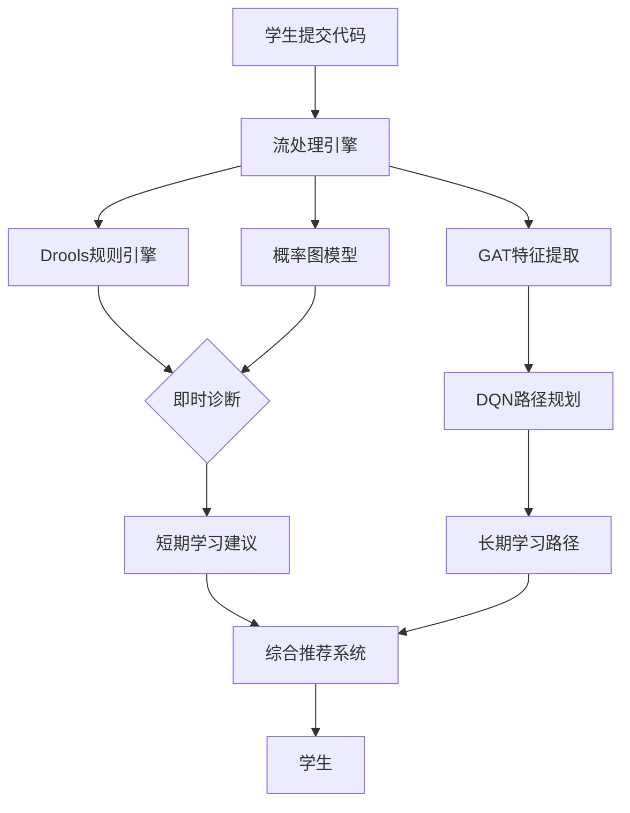

这两个功能虽然都涉及学习路径推荐，但它们的**技术实现**和**解决的问题**并不重复，而是**互补关系**。以下从多个维度分析它们的区别与协同作用：

---

### 一、功能定位对比

| **维度**       | **GAT + DQN 路径推荐**                        | **Drools + 概率图模型推理**                 |
| -------------- | --------------------------------------------- | ------------------------------------------- |
| **核心目标**   | 动态生成个性化学习路径，优化长期学习效果      | 保障教学逻辑严谨性，处理模糊知识关联        |
| **技术侧重点** | 基于图神经网络的语义理解 + 强化学习的动态决策 | 基于规则的确定性推理 + 概率图模型的模糊推理 |
| **适用场景**   | 长期学习路径规划，知识体系的动态优化          | 即时错误诊断与短期学习建议                  |
| **输入数据**   | 学生历史行为、知识图谱全局结构                | 当前代码缺陷、知识点依赖关系                |
| **输出结果**   | 长期学习计划（如"未来2周的学习路径"）         | 即时学习建议（如"当前应学习Java Optional"） |
| **决策粒度**   | 粗粒度（知识领域级别）                        | 细粒度（具体知识点级别）                    |

---

### 二、技术实现对比

#### 1. **GAT + DQN 路径推荐**
- **技术特点**：
  - 使用图注意力网络（GAT）挖掘知识图谱中的高阶关系
  - 通过深度Q网络（DQN）实现长期学习路径的动态规划
- **典型应用**：
  - 从学生的代码缺陷模式中发现知识薄弱点
  - 生成未来一段时间的学习计划（如"先学习链表，再学习图遍历"）

#### 2. **Drools + 概率图模型推理**
- **技术特点**：
  - 使用规则引擎（Drools）执行确定性的教学逻辑
  - 通过贝叶斯网络处理模糊知识关联
- **典型应用**：
  - 即时诊断代码缺陷（如"空指针异常"）
  - 提供短期学习建议（如"建议学习Java Optional"）

---

### 三、协同作用分析

#### 1. **短期与长期规划的互补**
- **Drools + 概率图模型**：解决"当前应该学什么"的问题
  - 示例：检测到空指针异常 → 建议学习Java Optional
- **GAT + DQN**：解决"未来应该怎么学"的问题
  - 示例：根据历史数据规划"Java基础 → 并发编程 → 分布式系统"的学习路径

#### 2. **规则与学习的互补**
- **Drools + 概率图模型**：提供即时、确定性的教学反馈
  - 示例：未掌握链表 → 禁止学习图遍历
- **GAT + DQN**：通过强化学习动态优化长期策略
  - 示例：根据学生学习效果调整知识点的推荐顺序

#### 3. **局部与全局的互补**
- **Drools + 概率图模型**：关注局部知识点的关联
  - 示例：空指针异常 → 异常处理知识
- **GAT + DQN**：关注全局知识体系的优化
  - 示例：从代码缺陷模式中发现学生对"内存管理"领域的整体薄弱

---

### 四、典型工作流程

---

### 五、实际应用案例

#### 1. **场景描述**
- 学生A频繁出现空指针异常，同时对递归理解不足

#### 2. **Drools + 概率图模型的作用**
- 即时诊断：
  - 规则引擎：检测到空指针异常 → 建议学习Java Optional
  - 概率图模型：根据错误频率推测学生可能缺乏异常处理知识

#### 3. **GAT + DQN 的作用**
- 长期规划：
  - GAT：发现学生对"内存管理"和"递归"领域的整体薄弱
  - DQN：生成学习路径："Java基础 → 异常处理 → 递归与回溯 → 动态规划"

#### 4. **综合推荐**
- 短期建议：立即学习Java Optional
- 长期计划：按照生成的学习路径逐步提升

---

### 六、总结

| **功能**     | **GAT + DQN 路径推荐**                        | **Drools + 概率图模型推理**                 |
| ------------ | --------------------------------------------- | ------------------------------------------- |
| **核心价值** | 长期学习路径的动态优化                        | 即时错误诊断与短期学习建议                  |
| **技术特点** | 基于图神经网络的语义理解 + 强化学习的动态决策 | 基于规则的确定性推理 + 概率图模型的模糊推理 |
| **协同作用** | 提供全局学习规划                              | 提供局部学习建议                            |

这两个功能分别从**短期反馈**和**长期规划**两个维度出发，共同构建了一个完整的智能学习推荐系统。它们的结合既能满足即时教学需求，又能优化长期学习效果，实现了从"点"到"面"的全方位支持。