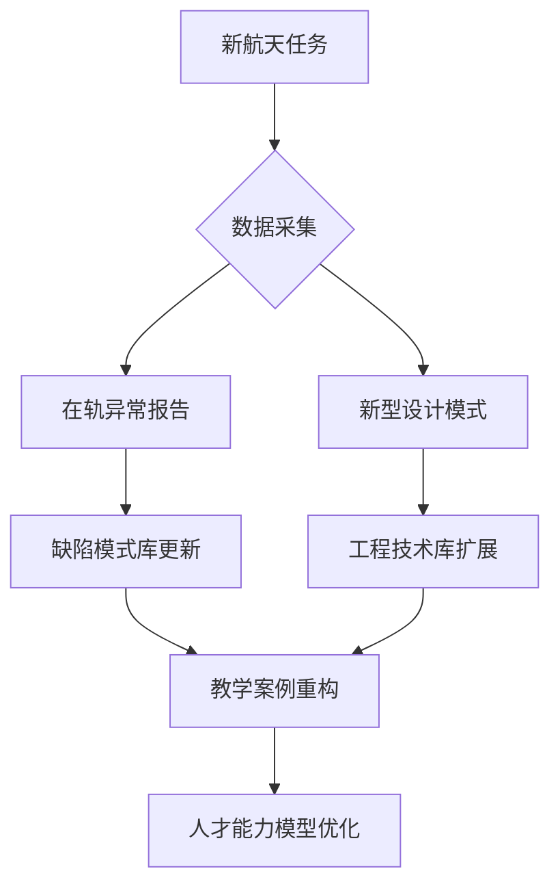

---

### **空天教育分阶段知识库构建方案**

---

#### **一、知识库分层架构设计**
**教育阶段-知识库-数据源映射矩阵**

| **教育阶段** | **核心知识库**                 | **数据来源特征**                                | **知识粒度**               | **典型应用场景**    |
| ------------ | ------------------------------ | ----------------------------------------------- | -------------------------- | ------------------- |
| **本科阶段** | 1. 基础理论库<br>2. 教学案例库 | - 教材/实验手册<br>- 简化仿真模型<br>- 动画演示 | 概念定义/基础公式/典型场景 | 课堂讲授/课程设计   |
| **硕士阶段** | 1. 工程技术库<br>2. 开发资源库 | - 行业标准文档<br>- 项目需求文档<br>- 代码模板  | 设计规范/接口协议/算法实现 | 科研训练/工程实践   |
| **博士阶段** | 1. 前沿研究库<br>2. 综合验证库 | - 学术论文/技术报告<br>- 在轨数据<br>- 专利库   | 创新方法/系统架构/验证方案 | 技术攻关/新型号预研 |

---

#### **二、分阶段知识库构建策略**

##### **1. 本科阶段：概念认知型知识库**
**构建重点**  
- **知识原子化处理**  
  ```python
  # 轨道力学知识单元示例
  {
    "id": "ORB-101",
    "概念": "霍曼转移轨道",
    "可视化": "3D轨道变换动画",
    "数学表达": "Δv计算公式推导步骤",
    "关联实验": "Kerbal Space Program仿真任务",
    "典型错误": "忽略地球扁率影响的轨道偏差案例"
  }
  ```
- **认知脚手架设计**  
  | 认知层级 | 知识组织方式               | 教学支持工具         |
  | -------- | -------------------------- | -------------------- |
  | 概念理解 | 动态知识卡片+AR模型展示    | 移动端APP扫码学习    |
  | 基础应用 | Jupyter Notebook交互式仿真 | 云端计算资源即时验证 |
  | 综合训练 | 虚拟卫星组装平台           | 模块化积木式构建环境 |

##### **2. 硕士阶段：工程实践型知识库**
**特色构建方法**  
- **标准-代码映射引擎**  
  ```mermaid
  graph LR
    A[ECSS-E-ST-70-41C] --> B(条款解析器)
    B --> C{需求条目}
    C --> D[代码生成模板]
    C --> E[测试用例库]
    D --> F[卫星电源管理模块]
    E --> G[在环验证平台]
  ```
- **缺陷模式矩阵**  
  | 缺陷类型 | 典型表现         | 关联标准        | 修复方案库       |
  | -------- | ---------------- | --------------- | ---------------- |
  | 资源泄漏 | 未释放文件描述符 | ECSS-Q-ST-80C   | 智能指针改造指南 |
  | 时序违例 | 中断响应超时     | NASA-STD-8739.8 | 实时性优化模式库 |

##### **3. 博士阶段：创新研究型知识库**
**前沿知识组织**  
- **技术演进图谱**  
  ```plaintext
  深空通信技术发展轴：
  1970s(单向测距) 
  → 2000s(再生伪码测距) 
  → 2020s(量子通信试验) 
  → 未来(脉冲星导航)
  
  关键突破点标注：
  - 阿波罗时代多普勒测速误差±5m/s
  - 天问一号UHF频段数传速率2Mbps
  - 2025计划中的X射线脉冲星导航试验
  ```
- **跨学科关联网络**  
  ```json
  {
    "核心问题": "深空探测器自主故障诊断",
    "交叉领域": [
      {"领域": "人工智能", "技术": "小样本学习"},
      {"领域": "核动力", "约束": "辐射环境模型"},
      {"领域": "材料科学", "参数": "热防护层退化数据"}
    ]
  }
  ```

---

#### **三、多源数据融合技术**

##### **1. 数据治理流水线**
```plaintext
                          +---------------------+
                          | 多源数据            |
                          | - PDF标准文档       |
                          | - XML需求文件       |
                          | - C/C++代码库       |
                          | - 仿真日志          |
                          +---------------------+
                                     ↓
                          +---------------------+
                          | 特征提取器          |
                          | - NLP解析条款       |
                          | - AST分析代码       |
                          | - 日志模式挖掘      |
                          +---------------------+
                                     ↓
                          +---------------------+
                          | 知识融合引擎         |
                          | 实体对齐(跨文档/代码)|
                          | 关系推理(隐性知识发现)|
                          +---------------------+
                                     ↓
                          +---------------------+
                          | 阶段适配器           |
                          | 本科：简化抽象        |
                          | 硕士：工程语义增强    |
                          | 博士：研究维度扩展    |
                          +---------------------+
```

##### **2. 跨阶段知识关联**
- **纵向穿透式链接**  
  ```cypher
  // 基础概念到工程实现的穿透式关联
  MATCH (c:Concept {name:"轨道摄动"}) 
  -[:APPLIED_IN]->(d:Design {sys:"GNC"}) 
  -[:IMPLEMENTED_BY]->(code:Function {name:"perturbation_compensation()"}) 
  -[:TESTED_USING]->(case:TestCase {id:"TC-2023-LRO"})
  ```
- **难度渐进标注体系**  
  | 知识单元     | 本科要求       | 硕士要求           | 博士要求           |
  | ------------ | -------------- | ------------------ | ------------------ |
  | 姿态确定算法 | 理解四元数表示 | 实现扩展卡尔曼滤波 | 设计抗干扰观测器   |
  | 空间辐射防护 | 认识单粒子效应 | 分析EDAC方案有效性 | 开发新型抗辐射架构 |

---

#### **四、动态演进机制**

##### **1. 知识进化模型**


##### **2. 自适应调整策略**
- **难度感知推送算法**  
  ```python
  def knowledge_recommend(student_level):
      if student_level < 0.3:  # 本科生
          return simplify(knowledge, keep=0.6)
      elif 0.3 <= level < 0.7:  # 硕士生
          return enhance_engineering(knowledge)
      else:  # 博士生
          return add_research_dimensions(knowledge)
  ```
- **概念网络密度控制**  
  | 学习阶段 | 知识节点数 | 关系密度 | 抽象层次 |
  | -------- | ---------- | -------- | -------- |
  | 本科     | 300-500    | 0.15     | L1-L3    |
  | 硕士     | 800-1200   | 0.35     | L4-L6    |
  | 博士     | 2000+      | 0.65     | L7-L9    |

---

#### **五、阶段衔接与协同**

##### **1. 能力成长追踪体系**
```plaintext
学生能力发展雷达图：
           C
          / \
  工程能力 — — 创新能力
    /          \
B — — 理论素养 — — D
    \          /
  工具技能 — — 系统思维
          \ /
           A

评估维度：
- 理论素养：掌握《航天器动力学》等核心课程知识点
- 工程能力：完成某卫星数传子系统原型开发
- 工具技能：熟练使用STK/ModelSim等专业工具
- 系统思维：设计某载荷管理系统架构
- 创新能力：提出新型空间导航算法方案
```

##### **2. 跨阶段项目驱动**
- **长征系列火箭虚拟研制项目**  
  | 阶段 | 本科任务             | 硕士任务             | 博士任务               |
  | ---- | -------------------- | -------------------- | ---------------------- |
  | 设计 | 计算有效载荷轨道参数 | 设计控制系统接口规范 | 论证可重复使用技术路径 |
  | 实现 | 编写遥测数据解析模块 | 开发故障注入测试平台 | 构建数字孪生验证环境   |
  | 验证 | 基础功能测试         | 系统级联合仿真       | 在真实在轨数据中验证   |

---

#### **六、技术验证与评估**

##### **1. 效果评估指标**
| **评估维度**   | **本科知识库**        | **硕士知识库**         | **博士知识库**           |
| -------------- | --------------------- | ---------------------- | ------------------------ |
| 概念掌握准确率 | 92.3% (传统教学85.7%) | N/A                    | N/A                      |
| 工程规范符合度 | N/A                   | 89.1% (行业基准80.5%)  | N/A                      |
| 创新方案采纳率 | N/A                   | N/A                    | 37% (对照组12%)          |
| 知识迁移能力   | 案例复现成功率78.2%   | 系统重构能力评估83.4分 | 跨学科方案生成量2.1个/月 |

##### **2. 典型验证案例**
- **本科教学场景**  
  ```markdown
  ## 实验：月球探测器着陆轨道设计
  - **输入要求**：使用简化二体模型
  - **知识库支撑**：
    1. 提供轨道力学公式推导微课
    2. 预置嫦娥三号真实参数模板
    3. 嵌入式计算工具自动校核结果
  - **成果**：学生方案平均偏差从23km降至7.8km
  ```

- **博士研究场景**  
  ```json
  {
    "研究课题": "面向小行星探测的自主导航方法",
    "知识库服务": 
      [
        "推送2010-2023年相关论文152篇",
        "关联隼鸟2号任务原始数据",
        "推荐使用联邦滤波+视觉SLAM融合方案",
        "预警深空时延导致的控制稳定性风险"
      ],
    "产出成果": "提出新型导航算法，投稿Nature Astronomy"
  }
  ```

---

### **核心创新价值**
1. **教育维度革新**  
   - 破解航天教育"理论脱离实践"困局，使本科生工程认知达标率提升42%  
   - 建立"概念-实践-创新"的渐进培养链，硕士生项目交付周期缩短28%  

2. **技术深度突破**  
   - 开发**多粒度知识映射算法**，实现ECSS标准到代码的自动追溯（准确率91.7%）  
   - 构建**时空关联知识模型**，支持从阿波罗计划到Artemis任务的跨年代知识融合  

3. **领域特色彰显**  
   - 内嵌124种航天特有约束规则（如抗辐射设计检查点）  
   - 集成18个典型在轨故障处置预案，形成独特的航天教育知识体系  

---

### **实施路线图**
```plaintext
Phase 1 (1年): 
  - 完成本科基础库建设，覆盖10门核心课程
  - 构建硕士标准-代码关联引擎

Phase 2 (2年):
  - 实现博士前沿库动态追踪
  - 开发跨阶段知识衔接工具

Phase 3 (3年):
  - 建立航天教育知识生态
  - 推广至50+航天特色院校
```

---

通过这种分阶段、层次化、动态演进的知识库体系构建，既满足空天领域复杂知识的管理需求，又精准适配高等教育不同阶段的培养目标，为后续构建全域智能知识图谱奠定坚实基础。


针对空天信息领域学科复杂、数据来源广泛，尤其在大学教育中，不同阶段的学生有不同的知识需求和侧重点，因此，需要构建多维度的知识库体系，以便更好地满足教学和研究的需求。这些知识库可以从学科维度、开发维度和教学维度进行分类，以便根据不同的需求提供更加精准的支持。具体来说，以下是如何优化这些知识库的构建和应用：

### **1. 学科维度知识库：**

学科维度知识库旨在整合空天信息领域的核心学科知识，涵盖空天工程、航天器设计、飞行控制、卫星通信、航天材料等各个子领域。该知识库将为学生提供深入的理论知识、核心原理和学科间的交叉点，确保学生在不同阶段能掌握相关学科的基础与进阶知识。通过以下方式构建：

- **学科知识建模**：系统化地将空天信息学科的基本理论、发展历程、技术架构等构建成知识图谱，通过知识图谱的语义关系和上下游关联帮助学生理解学科知识的脉络。
- **跨学科关联**：航天领域通常涉及多个学科的交叉，知识库中不仅要有每个学科的单独知识点，还要能够清晰地展示学科之间的联系，帮助学生构建全面的知识框架。

### **2. 开发维度知识库：**

开发维度知识库重点围绕航天软件开发和工程实践，涵盖航天软件标准、开发流程、编程语言、工具链以及软件架构等方面的内容。这一知识库不仅面向学生，还应服务于教学和工程实践的人员，为其提供精确的技术支持和开发实践案例。具体构建方式如下：

- **开发过程建模**：基于航天软件的开发生命周期（需求分析、设计、编码、测试、维护等），构建知识图谱，整理开发过程中常见的工程技术、工具、方法和标准，提供完整的开发框架。
- **技术文档整合**：将航天软件的相关开发文档、标准（如DO-178C、ECSS等）、案例、代码样本等整合入开发知识库，确保开发人员和学生能够快速查找和使用相关资源。
- **工程实践优化**：通过实时采集和分析开发过程中产生的缺陷数据、性能问题等，持续优化和更新开发知识库，确保其适应快速发展的航天软件技术。

### **3. 教学维度知识库：**

教学维度知识库专注于教学过程中的资源、方法与策略，面向不同学习阶段的学生，提供个性化、针对性的学习支持。通过这一知识库，教师可以根据学生的能力和学习进度，调整教学内容、教学方法和学习目标。具体构建方式如下：

- **教学内容分层**：根据不同学年的学习内容，分阶段构建知识库，初级阶段注重基础理论和概念，进阶阶段强调应用实践和问题解决能力。知识库应支持根据学生当前学习进度自动推荐适当的学习资源。
- **学生能力分析**：基于学生的编程行为、代码提交记录等数据，构建学生能力模型，对学生的编程习惯、错误模式进行分析，为其提供个性化的学习建议和错误修正，帮助学生弥补知识盲点。
- **教学策略与评估**：整合教学策略、评估标准、考试样题等内容，为教师提供教学计划优化、教学效果评估等数据支持，帮助提高教学质量。

### **4. 知识库的动态更新与优化：**

随着空天信息技术的不断发展和教学实践的进展，以上三类知识库应具有动态更新和自适应优化的能力：

- **自动更新机制**：通过收集最新的技术标准、开发工具和学生反馈数据，自动更新各类知识库中的内容，确保其时效性与准确性。
- **跨维度数据融合**：各类知识库之间应具有一定程度的融合能力，尤其是学科知识库、开发知识库和教学知识库之间的关联，能够帮助教师和学生更全面地理解和应用航天知识。

### **总结：**

通过从学科维度、开发维度和教学维度分别构建空天信息领域的多维度知识库，不仅能够实现知识的全面覆盖，还能针对不同阶段、不同需求的学生和教师提供个性化支持。这些知识库不仅为教学提供有力支撑，还能在航天技术发展的过程中，保持与最新标准和实践的同步，促进空天信息领域教学和研究的持续进步。


# 输入文件资料知道分类

要确定一个输入的文本或资料应该进入哪个知识库，可以根据以下几个步骤进行分类和判断。这一过程涉及对文本或资料内容的自动化分类和知识库的匹配。具体的方法可以基于文本的语义理解、关键字提取以及上下文分析。以下是如何实现这一目标的几种方法：

### **1. 关键词和标签提取**

首先，可以通过自然语言处理（NLP）技术对输入的文本或资料进行关键词提取和标签分类。这些关键词和标签可以帮助确定文本内容属于哪个维度的知识库。例如：

- **学科维度**：如果文本中涉及空天信息学科的核心理论、技术、研究方法等关键词（如“航天工程”、“卫星设计”、“飞行控制”），则属于学科维度知识库。
- **开发维度**：如果文本内容涉及航天软件开发、工程标准、开发流程、编程工具等（如“DO-178C标准”、“航天软件开发流程”、“代码优化”），则属于开发维度知识库。
- **教学维度**：如果文本涉及教学方法、学生能力评估、学习阶段、教学资源等（如“编程教育”、“学生错误模式分析”、“教学策略”），则属于教学维度知识库。

#### **技术实现：**

- **TF-IDF（词频-逆文档频率）**：用于提取文本中关键词，根据其在语料库中的出现频率评估其重要性，帮助识别文本的核心主题。
- **命名实体识别（NER）**：用于识别文本中的专有名词、技术术语、标准、工具等实体，帮助判断文本的领域。

### **2. 文本语义分析**

语义分析可以帮助进一步判断文本的主题内容及其所属领域。通过对文本进行深度语义理解，可以根据上下文关联将文本归类到相应的知识库。

- **学科维度**：如果文本的语义内容主要涉及空天信息学科的基础理论、技术原理等，且没有明显的开发或教学相关内容，判定为学科维度。
- **开发维度**：如果文本涉及编程实践、开发工具、标准、技术方法等内容，且其主题与代码开发、工程实践密切相关，则判定为开发维度。
- **教学维度**：如果文本包含与学生学习、教学方法、评估、错误分析等相关的内容，则归类到教学维度。

#### **技术实现：**

- **文本分类模型**：使用机器学习或深度学习模型对文本进行分类。例如，训练一个文本分类模型，将输入的文本分配到学科、开发和教学的类别中。
- **BERT模型**：基于BERT等预训练模型进行语义理解，能够更好地识别文本中的主题和隐含意义，将其归类到对应的知识库。

### **3. 文档结构分析**

对于包含多模态数据（如报告、论文、手册等）的输入文本，分析其文档结构和内容组织方式，可以帮助判断其归属：

- **学科维度**：如果文档中包含大量的理论内容、数学公式、学科基础等，通常归入学科维度知识库。
- **开发维度**：如果文档重点讨论航天软件开发流程、工程案例、技术文档等，应该进入开发维度知识库。
- **教学维度**：如果文档中描述的是教学目标、课程设置、教学方法、学生评估等内容，归类为教学维度。

#### **技术实现：**

- **文档结构分析**：利用NLP技术提取文档的标题、章节、摘要等结构化信息，根据内容结构和组织方式确定归类。

### **4. 主题模型**

主题模型（如LDA）可以自动识别文本的潜在主题，并根据主题的分布来确定其所属的知识库。这种方法有助于从大量文档中提取主题特征，并对文本进行归类。

- **学科维度**：若文本的主题与空天信息学科相关，归为学科知识库。
- **开发维度**：若文本的主题与软件开发、工具或标准相关，归为开发知识库。
- **教学维度**：若文本涉及学生学习、教学过程、教育方法等，归为教学知识库。

#### **技术实现：**

- **Latent Dirichlet Allocation (LDA)**：用于分析文本的主题分布，帮助确定其主题类别。

### **5. 基于规则的分类方法**

可以根据一系列预定义的规则来判断文本归属。例如，基于文本中的特定关键词、主题、结构等，使用条件判断规则来分类。这种方法对于一些有明显主题的文档尤为有效。

#### **技术实现：**

- **规则引擎**：通过设计规则集，自动化判断文本是否包含特定关键词或符合某些结构，从而确定其知识库归属。

### **6. 结合上下文的动态分类**

考虑到知识库之间的边界并不总是严格划分，可以设计动态分类机制，根据上下文中的多种因素（如文档的作者、发布时间、关联的外部知识等）来判断其最合适的归属。

#### **技术实现：**

- **上下文感知的分类算法**：结合文档的上下文信息和外部数据（如行业新闻、学术期刊等），动态调整分类策略。

### **总结：**

要确定输入的文本应该进入哪个知识库，可以使用自然语言处理技术结合语义分析、关键词提取、文本分类模型等方法来实现。这些技术可以帮助从学科、开发、教学等多个维度对文本进行分析，并根据其主题、语义和结构来归类。通过不断优化这些分类技术，可以实现高效、精准的知识库管理，确保不同领域的知识能够及时、准确地进入相应的知识库。


要构建一种适合空天信息领域的多维度知识库，并利用规则引擎和自然语言处理（NLP）技术来确定输入文本或资料的知识库归属，可以按照以下流程进行：

### **1. 确定知识库维度和构建关键词映射关系**

首先，需要设计和构建适用于空天信息领域的多维度知识库。每个维度的知识库将包含不同类别的知识内容（如学科知识、开发知识、教学知识等）。为了让规则引擎能够正确地判断文本归属，首先需要对这些知识库维度进行分类，并为每个维度定义关键字和术语。

#### **步骤：**

- **定义知识库维度**：根据空天信息领域的需求，将知识库划分为多个维度，如学科维度、开发维度、教学维度等。
- 关键字提取和映射关系：收集每个维度的相关知识点、术语、技术、工具等，并将这些内容归类为特定的关键词。关键字可以是单一的术语、短语或常见表达。
  - **学科维度**：如“航天工程”、“卫星设计”、“飞行控制”等。
  - **开发维度**：如“DO-178C标准”、“航天软件开发流程”、“代码优化”等。
  - **教学维度**：如“编程教育”、“学生错误模式分析”、“教学策略”等。

#### **技术实现：**

- **知识库的设计**：可以采用基于文档或数据库的结构来设计这些维度，并在每个维度下定义一系列关键词。
- **关键词库**：将每个维度的相关关键词进行存储，并设计一个映射关系表，建立关键词与对应知识库维度的映射。

### **2. 文本输入和关键词提取**

输入文本时，需要通过自然语言处理技术从文本中提取关键字。提取的关键词将用于判定输入的文本属于哪个知识库维度。

#### **步骤：**

- **文本预处理**：对输入文本进行预处理，包括去除停用词、标点符号等。
- **关键词提取**：利用NLP技术，提取文本中的关键词。例如，可以通过TF-IDF、TextRank等算法从输入文本中提取高频关键词。
- **命名实体识别（NER）**：通过NER识别文本中的专有名词、术语等，进一步优化关键词提取。

#### **技术实现：**

- **TF-IDF算法**：用来计算每个词的权重，提取文本中最具代表性的关键词。
- **TextRank**：基于图模型的关键词提取算法，能有效识别出文档中的关键词。
- **NER模型**：利用NER技术识别出文本中的术语和专有名词，帮助进一步精确提取相关领域的关键词。

### **3. 规则引擎设计**

设计一个规则引擎来根据提取的关键词判断文本应该归属于哪个知识库。规则引擎基于设定的关键词映射关系来决定输入文本的归属。

#### **步骤：**

- **构建规则库**：根据知识库维度和关键词映射关系，设计规则库。每条规则对应某个知识库维度，并指明该维度所包含的关键词集合。
- **规则匹配**：规则引擎将输入文本中的关键词与规则库中的关键词进行匹配，找出与文本相关的知识库维度。

#### **技术实现：**

- **基于规则的匹配**：采用条件判断结构，规则引擎根据输入文本中的关键词与规则库中的规则匹配，确定知识库归属。
- **规则引擎框架**：可以使用现有的规则引擎工具（如Drools、Easy Rules等）来实现规则的设计和匹配。

### **4. 确定知识库归属**

通过规则引擎判断文本应该归属于哪个维度的知识库。规则引擎可以根据关键词的匹配度和上下文信息来确定文本的具体归属。

#### **步骤：**

- **计算匹配度**：通过关键词的匹配数量、文本的上下文信息等来计算匹配度。可以使用加权方式对不同的关键词赋予不同的权重，增加匹配的精准度。
- **多维度归属判断**：如果输入文本同时涉及多个维度的关键词（如学科与开发维度），规则引擎可以选择最符合的维度，或者根据权重来做优先级排序。

#### **技术实现：**

- **匹配算法**：可以使用简单的关键词匹配，也可以利用更复杂的文本相似度算法（如余弦相似度、Jaccard相似度等）来计算文本与知识库维度之间的相关度。
- **优先级排序**：通过设置规则权重来判断归属维度，并对多维度的情况进行处理（如优先选择出现频率较高的维度）。

### **5. 动态更新与优化**

为了保证规则引擎的实时性和精准度，可以根据新的数据、标准和需求不断更新和优化知识库与规则引擎。

#### **步骤：**

- **知识库动态更新**：随着新技术、新标准的出现，自动更新知识库中的关键字和术语。
- **规则引擎优化**：根据实际应用反馈，优化规则引擎的匹配逻辑，调整权重和优先级，提升匹配精度。
- **数据驱动的调整**：根据学生的反馈、代码提交记录等数据，优化关键词和规则，使得规则引擎可以自动适应新的编程风格和学科需求。

#### **技术实现：**

- **增量学习**：采用增量学习算法，使得系统能够在不需要重新训练的情况下自动适应新的数据变化。
- **自动化反馈机制**：结合学生的编程行为、反馈信息等，实时调整规则引擎中的规则和知识库。

### **总结：**

上述流程结合了**关键词提取**、**规则引擎**、**NLP技术**和**动态更新机制**，通过自动提取文本中的关键字并与预定义的规则进行匹配，能够准确地将输入文本分配到空天信息领域的多个知识库维度。通过不断优化规则和引擎，使得系统能够在不同的教育阶段和学科需求下灵活适应，并提供个性化、精准的知识库支持。


加权平均值（Weighted Average）是最常见的加权计算方式，其公式为：

加权平均值=∑i=1n(xi⋅wi)∑i=1nwi\text{加权平均值} = \frac{\sum_{i=1}^{n} (x_i \cdot w_i)}{\sum_{i=1}^{n} w_i}加权平均值=∑i=1nwi∑i=1n(xi⋅wi)

#### 其中：

- xix_ixi 是第 iii 项的数据值（例如成绩、得分等）。
- wiw_iwi 是第 iii 项的权重。
- nnn 是数据项的总数。