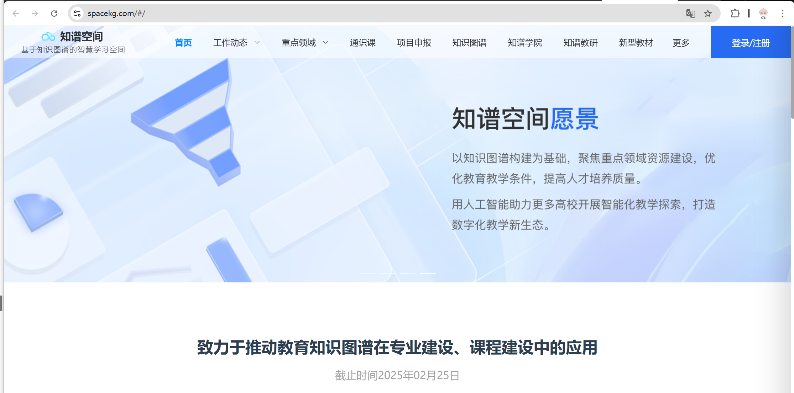

## 希冀教研平台

https://www.educg.net/

希冀起源于北航计算机学院，于2003年开始研发并投入使用。基于希冀建成了涵盖实验、质量指标及过程控制的完整在线实验体系，实现了“任何人、任何时间、任何地点均能开展实验学习” 的目标。通过持续追踪和采集全过程学习数据，支撑教师开展个性化教学和教学方式创新研究。

**缺点1：**侧重于提供**项目管理和协作支持**，虽然也有集成部分功能（如CI/CD、代码托管），但尚未覆盖完整的开发生命周期，重点更多是在实践教学和小组合作上。

**缺点2：**作为一个通用型的教学平台，虽然它支持多种课程与项目管理，但其在特定领域（如空天信息、航天技术等）上的深度支持较为有限 

**缺点3：**虽然该平台能够提供教学上的实践支持，但对科研与教学的结合程度较弱，更多专注于常规的教学活动支持。

**优势点1：**通过增加AI支持，完善需求工程，平台能覆盖软件需求分析、设计、开发、测试、部署的全流程自动化，保证整个软件开发生命周期的高效、标准化运作

**优势点2:** 台专注于空天信息领域的研发教学，能够紧密结合航天、航空等专业的需求，提供个性化的工具和平台来支持相关技术的教学与研究。这种定制化的功能使得平台能够更好地与专业课程及实际研究项目相结合，提升学生的专业能力与实践经验。

**优势点3：**通过科研项目的模拟与实际任务的应用，帮助学生了解行业前沿技术，同时也为科研人员提供了更有效的工具。

优势点：**全流程自动化支持**、**跨学科需求对接**与工程化能力培养方面，它**不仅关注开发技能**，还关注**从需求到交付的全过程管理**，提升学生的整体工程能力。而希冀教研平台则主要关注小组协作与教学管理，在功能上较为基础，更适合标准化的教学过程。

## 知谱教研平台

而**知谱教研平台**更侧重于**教学和教研管理功能**，它在组织和管理教学活动、促进团队协作、资源共享等方面表现优秀，但在**软件开发全生命周期支持**、**自动化工具的集成**和**专业领域的定制化需求**方面相对较弱。因此，知谱教研平台更适合传统的教学和教研活动管理，而空天信息软件工厂研发教学平台则是为提升学生的工程能力、参与真实研发项目提供了更强的技术支持。

**空天信息软件工厂研发教学平台**相较于**知谱教研平台**，具有明显的优势，特别是在**工程化支持、自动化流程、专业领域定制化功能**以及**科研与教学深度融合**方面。它为学生提供了一个完整的软件开发与工程实践环境，能够帮助学生在真实的软件开发过程中进行学习和应用。

## 福州大学教研平台

**一个系统搭建一个实验平台，多个系统互相隔离，通过前台界面整合**

**优点：**

**灵活性高**：各个系统相互隔离，可以根据实验需求选择性地调整某个系统的配置或者功能，而不影响其他系统。

**可扩展性强**：可以独立扩展某个实验平台的系统，或者新增系统而不会影响其他已有系统。

**系统安全性高**：隔离的架构有助于保护系统之间的数据和逻辑，避免了不同系统之间的潜在冲突。

**缺点：**

**容错性强**：一个系统出现问题时，不会直接影响到其他系统，提升了平台的整体可靠性。

**集成复杂**：前端界面的整合需要额外的工作，确保不同系统的界面风格、数据格式和交互方式统一，开发和维护成本较高。

**资源浪费**：如果每个系统都独立运行，可能会造成资源的重复利用和浪费，尤其是在物理资源上。

**系统间数据共享困难**：由于系统隔离，跨系统的数据传递和共享可能需要额外的中间层进行处理，增加了复杂性和延迟。

**优势：**基于软件工厂模式的“空天信息软件工厂研发教学平台”通过集成自动化工具、简化流程、提高效率和质量，不仅能帮助学生和教研人员掌握全流程的自动化技术，还能提升他们的实践能力、协作能力和项目管理能力，具有明显的优势，尤其适用于教学和研发环境。

## **特定领域的教学平台**--例如360网络攻防

https://360.net/product-center/360-target-platform/practical-training

不够集成，只是针对特定领域