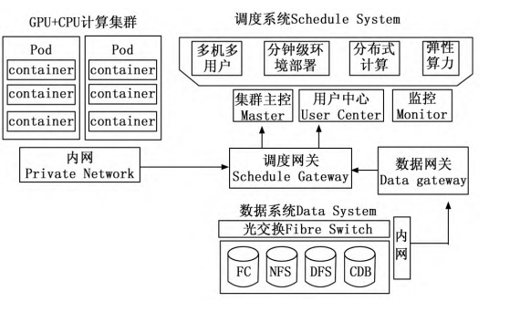

# 云原生架构计算平台在影像医学教学中的应用实践

### 教研平台工作流程

- 支持多领域、多人员、多角色管理。
- 简化友好的向导式操作界面，促进学生实践成果的互相学习和快速迭代。
- 数据分析方案涵盖模型训练、推理和数据管理，提供一站式数据分析服务。

### 并发集群方式

- 定义高性能计算机服务器集群方法，支持大量学生调用医学影像数据并进行智能分析。
- 硬件架构包括GPU服务器、存储服务器和CPU服务器，确保高速数据交换和网络连接。

### 硬件架构

### PASS（平台即服务）

它提供了计算资源、调度和数据存储功能，供开发者或企业用来构建和部署自己的应用。用户需要在这个平台上执行任务、管理资源

#### 自定义镜像管理

- 允许学生基于通用基础镜像快速定制私有镜像模板，支持多种深度学习框架。

- 提供高效的资源管理和算力支持，为学生开展实践课程提供有效支撑。

  

#### Docker资源调度

- 构建基于负载均衡原理的资源调度方式，实时监控每个学生调用平台资源情况。

- 支持细粒度拆分和集群组合，确保高效稳定的分布式计算环境。

  

## 云原生架构计算平台在影像医学教学中的应用实践

### AI医学影像辅助诊断

- 结合云原生架构计算平台，提升学生诊断技能。
- 支持多种深度学习框架和算法，助力学生掌握最新AI技术在医学影像分析中的应用。

### 多源异构影像数据的融合

- 整合细胞形态学、背景病理、成分定量及免疫组化等多维分析。

- 提升医学院学生对多组学数据融合的理解，拓宽学术视野与科研创新路径。

  