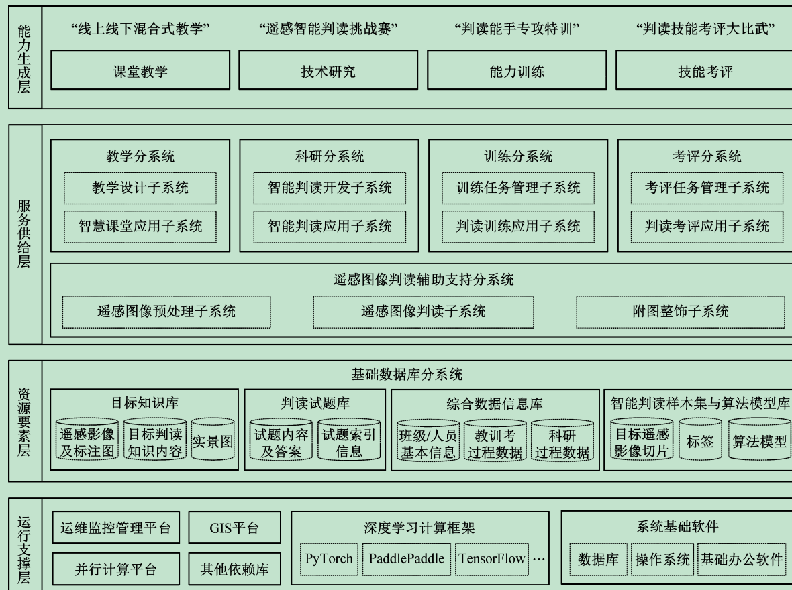
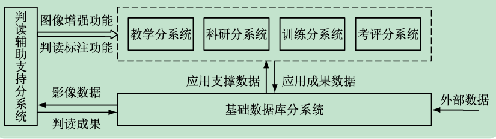
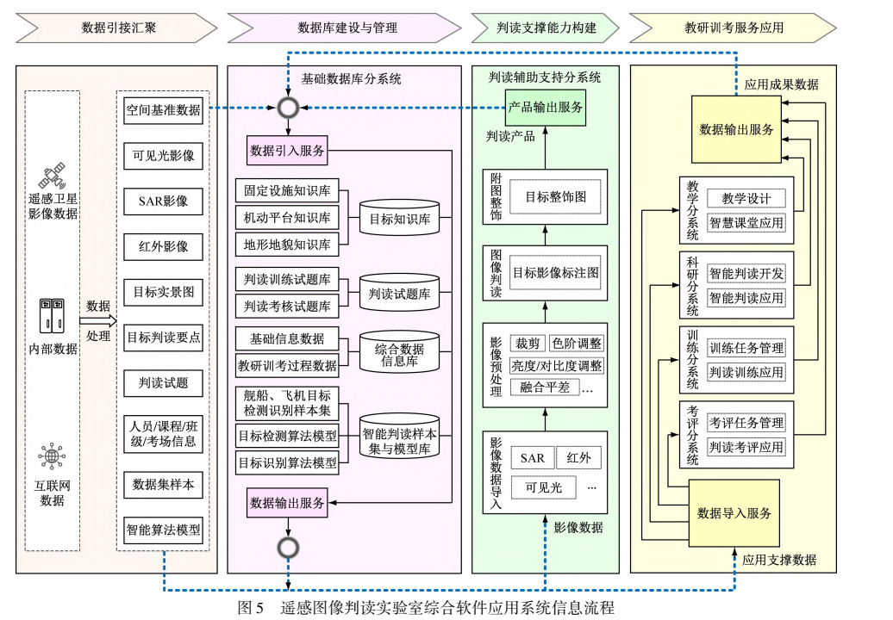
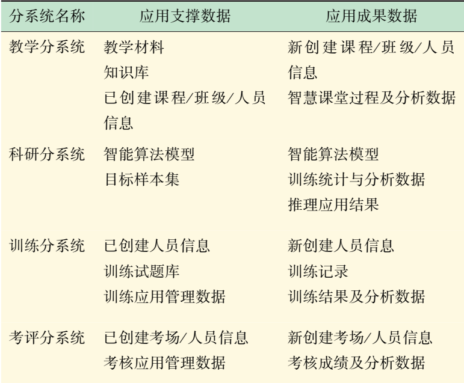
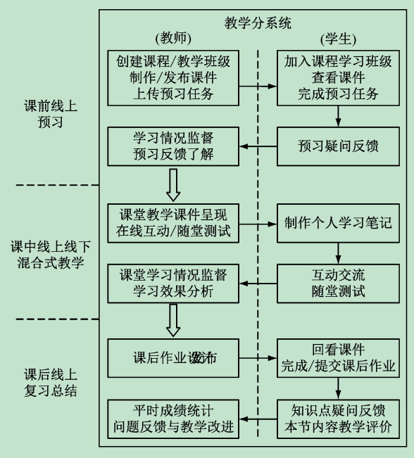
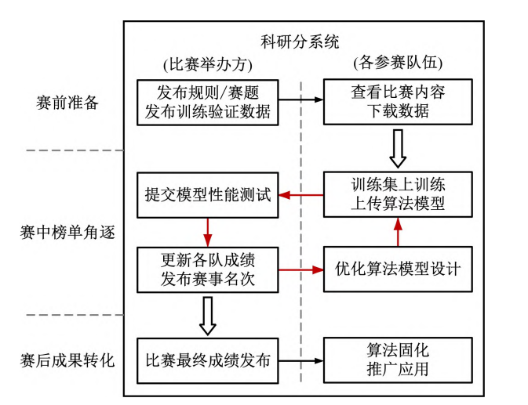
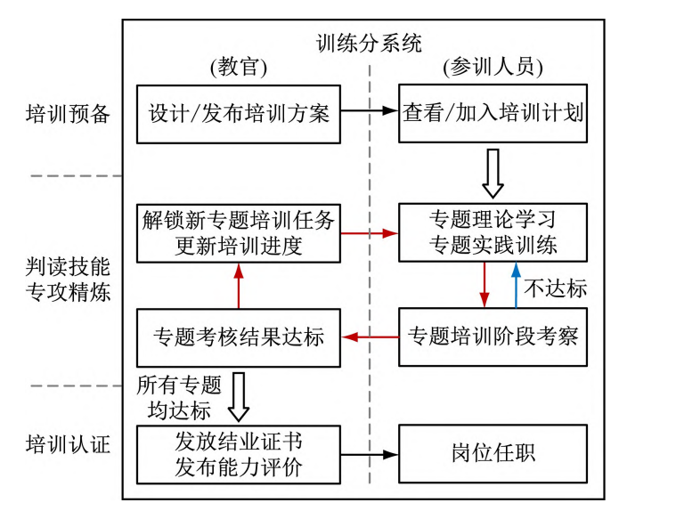
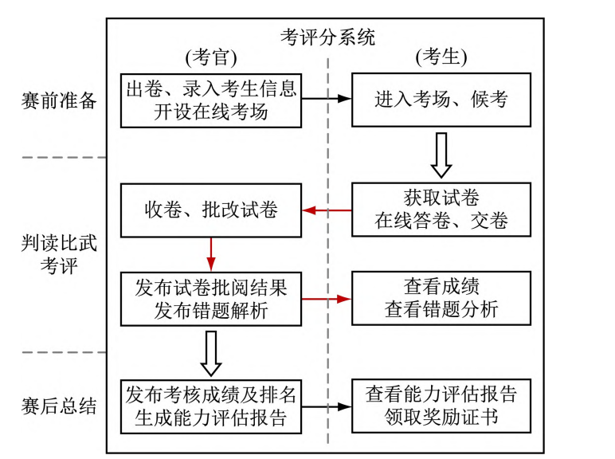

# 教研训考”一体化平台“

当前存在的问题

- 教学支撑系统落后，难以推行先进教学理念和方法。
- 教学与科研活动缺乏深入交流互动，导致科教融合育人质量不高。
- 缺乏丰富全面的基础数据，实践教学面临困境。
- 考核评价模式呆板，难以激发学生的发展后劲。

#### 基础硬件支撑系统

- 大容量存储阵列：提供充足的存储资源。
- 大规模并行计算服务器：支持智能算法快速训练验证。
- 教学训练计算机：为教师和学生提供操作终端。

#### 综合软件应用系统

- 基础数据库分系统：提供目标知识库、判读试题库等。
- 判读辅助支持分系统：提供图像预处理、判读标注等功能。
- 教学分系统：支持个性化教学材料制作和智慧课堂应用。
- 科研分系统：提供智能判读开发环境和应用功能。
- 训练分系统：提供训练习题生成、自动批阅等功能。
- 考评分系统：提供考场创建管理、试卷生成等功能。

### 系统架构设计

- 运行支撑层：提供运维监控管理平台、GIS平台等。
- 资源要素层：提供所需数据资源，如目标知识库、判读试题库等。
- 服务供给层：提供判读操作所需的辅助支持功能及各项功能服务。
- 能力生成层：为课堂教学、技术研究、能力训练和技能考评提供具体解决方案。

### 交互机制

