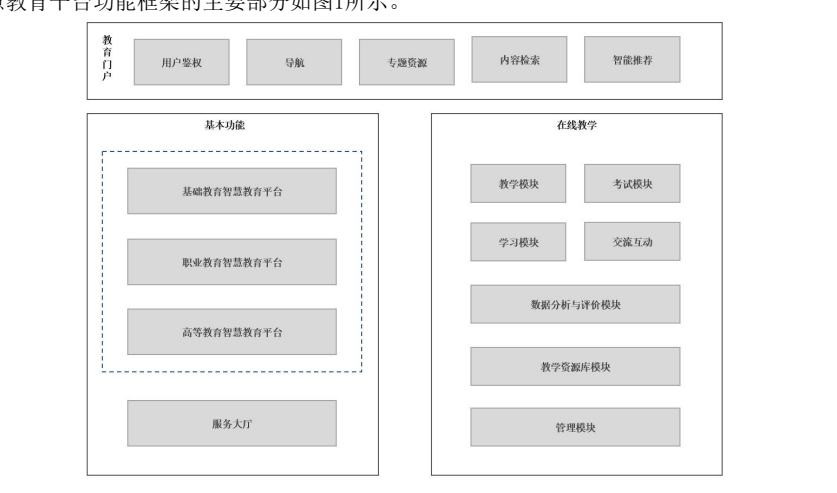

360教研平台

讯飞智慧教育

中华人民共和国教育行业标准  2022-11-30发布

**基本功能**

 职业教育智慧教育平台：规定了智慧教育平台的职业教育功能要求，主要包括五育资源、专业与课程服务中心、虚拟仿真实训中心、教师能力提升中心、教材资源中心等模块；

高等教育智慧教育平台：规定了智慧教育平台的高等教育功能要求，主要包括慕课学习、虚拟仿真实验、教材及其他资源、教师教研、特色专题、教育教学资讯等模块；

服务大厅：规定了智慧教育平台提供的服务功能，主要包括就业服务、考试服务、学历学位服务、留学服务等模块。

**在线教学**
智慧教育平台的在线教学基本功能包括教学、学习、数据分析与评价、教学资源、交流互动，可拓展功能包括考试、AI虚拟助教等。
a) 教学模块：支持教师教学流程，应包括教学管理、备课、授课、作业管理，支持同步在线教学与异步在线教学两种教学模式；
b) 学习模块：支持同步在线学习与异步在线学习两种学习方式，应包括学习管理、学习交流和学习推荐；
c) 考试模块：支持完整的考试过程，应包括考试管理、自动和手动出卷、试卷批改、考试结果及考试统计，可以提供考试防作弊功能。考试模块可以作为在线教学系统的可选模块；d) 数据分析与评价：基于对智慧教育平台的教学数据和学习行为数据的分析能够形成对教和学的科学评价、学情分析及电子学档；
e) 教学资源库：对不同形式和类型的教学资源提供资源操作、资源管理、资源存储和资源共享的功能；
f) 交流互动：支持智慧教育平台不同角色的用户进行沟通交流的功能的集合，应包括课堂内外沟通交流；
g) 管理模块：支持系统管理、学情管理、教务管理、课程内容管理等功能；
AI 虚拟教学助手：贯穿在线教学全过程，支持交流互动的视频、语音等多模态交互、个性化学习、视频行为分析、图像审核和语音审核、教学资源智能处理等功能。
**智慧教育平台门户功能要求**
用户鉴权
验证用户是否有访问系统的权限，支持用户注册、用户登录、账号管理、授权管理功能。
a) 用户注册。
b) 用户登录

c) 账号管理

d) 授权管理

